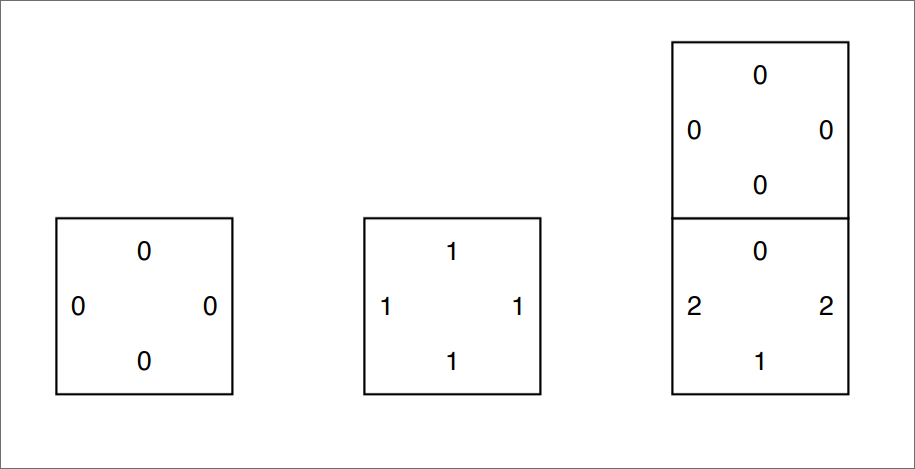
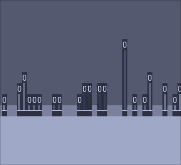
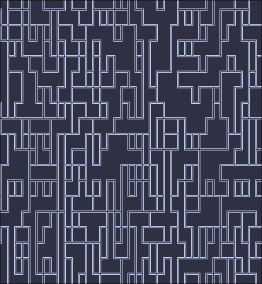
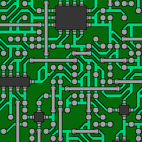
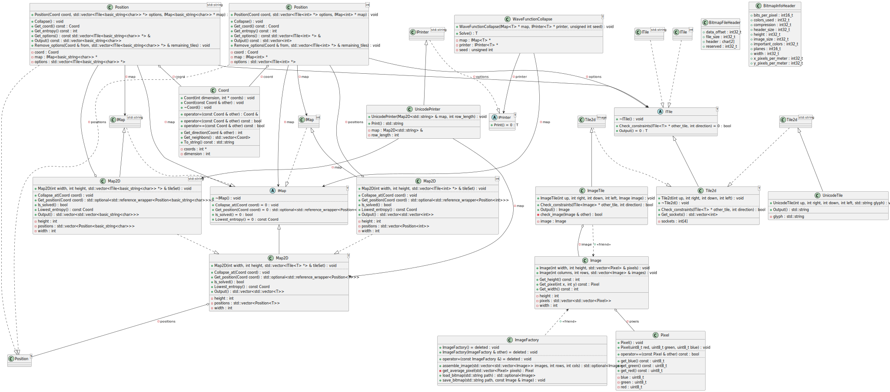

# Wave function collapse

### Introduction

The term "wave function collapse" originates from quantum mechanics. It refers
to the reduction of a wave function from a superposition of states to a single
state. In computer science, the term is used to describe an algorithm that takes
a set of superpositions and reduces them to a single state. This algorithm can
be used in a variety of applications. For example:

- Generating random terrain in video games
- Recreating/generating images
- Solving optimization problems

### How it works

The algorithm works by taking a tile-based map and assigning each tile a
probability of being a certain type. For example, in a map of grass and water
tiles, each tile would have a probability of being grass or water. The algorithm
then iterates through each tile and assigns it a type based on the probabilities
of its neighbors. This process is repeated until the map is fully generated. The
process allows for adding constraints. For example, if we add beach tiles, we
can specify that they must be adjacent to water tiles. Now we will generate a
map with lakes surrounded by beaches.

The algorithm can be further expanded by adding a way to generate tilesets from
images. The algorithm can be generalized to work in multiple dimensions,
allowing for the generation of 3D terrain or even 4D maps. It is also possible
to create more complex rules. For example, to generate a map with rivers, we can
specify that rivers must flow from high to low elevation.

# Design

This first design is a proof of concept and will only generate a 2D map of
unicode characters.

This design makes use of tiles. Each tile has 4 sockets, one for each side. This
socket indicates to which other tiles it can be connected on every side. The
goal of the algorithm is to find a valid configuration of tiles that satisfies
all the sockets. It achieves this by iteratively collapsing tiles and updating
the probabilities of the remaining tiles.

### Example

This is an example of using the unicode generator to generate a map with 3
different tiles:

- Sky
- Grass
- Stone

The tiles look like this in code:



If we create a 3x3 map with tiles it could look like this:


The algorithm starts with a map where on every position there is a superposition
of all the tiles. Next it collapses a random tile with the lowest entropy (the
least amount of possible tiles). Then it propagates this to its neighbors. In
this case it collapses the center tile to a grass tile. This causes the outcome
to be fully determined. Here is what would happen if it collapsed the center
tile to a sky tile:


In this case the outcome is not fully determined. The algorithm will need to go
through another iteration to collapse the remaining tiles.

## Unicode results

### Trees



### Pipes



### Seeding

It is possible to seed the random number generator to get the same results.

# Image generation

The general algorithm to generate images is nearly identical to the one used to generate unicode maps. The only difference being that image tiles are able to be rotated to create more permutations. Other than that the algorithm abstracts out the output, meaning that image tiles can be used in the same way as unicode tiles. The updated design includes classes to load, save and manipulate images.

## Image results

### Circuits

Generated using the circuit tileset from https://github.com/mxgmn/WaveFunctionCollapse:



# Building for the web

The project can be built for the web using [Emscripten](https://emscripten.org/). The project has a Makefile target to build the project for the web. This will generate an app.wasm file and an app.js file. The app.js file can be included in an HTML file to run the project in the browser. There two reasons this was done: firstly, it is useful to demo the project in the browser, and secondly, it allows for the use of javascript libraries to visualize more complex maps. For example, it would be possible to use a 3D engine to visualize a 3D map.

## File IO

A tricky part of compiling with emscripten is reading and writing files. The image tiles are read from the filesystem and the final image is written to the filesystem. This is not possible in the browser. To get around this emscripten provides a temporary filesystem called MEMFS. To read the images from MEMFS they need to be embedded in the wasm file. This is done by using the `--embed-file <directory>` flag when compiling. This makes it so all embedded files can be read using regular C/C++ conventions. Reading the output image is done with this JS snippet:

```javascript
      const bmpData = Module.FS.readFile('/output.bmp');
      const bmp = new Blob([bmpData], { type: 'image/bmp' });
      url = URL.createObjectURL(bmp);
      img = document.createElement('img');
      img.src = url;
      document.body.appendChild(img);
```

# Class diagram

The Makefile of this project has a target to generate the class diagram. This class diagram is automatically generated using
[PlantUML](https://plantuml.com/) and
[clang-uml](https://github.com/bkryza/clang-uml) :



# Milestones

- [x] Create a 2D map generator with unicode characters
- [x] Test the algorithm with different tilesets
- [x] Create a 2D map generator with images
  - [x] Load images
  - [x] Generate tile from an image
  - [x] Assemble tiles into a new image
  - [x] Save final image
- [ ] Optimize image generation
    - [ ] Optimize 2d tiles by multithreading
    - [ ] Optimize image tiles by pruning tilesets
- [ ] Generate tilesets from images
- [ ] Create 3D map generator
- [ ] Visualize 3D map in a 3D engine

# References

- Wave function collapse algorithm
  - https://robertheaton.com/2018/12/17/wavefunction-collapse-algorithm/
  - https://github.com/mxgmn/WaveFunctionCollapse
- Tooling used
  - https://plantuml.com/
  - https://github.com/bkryza/clang-uml
  - https://emscripten.org/
